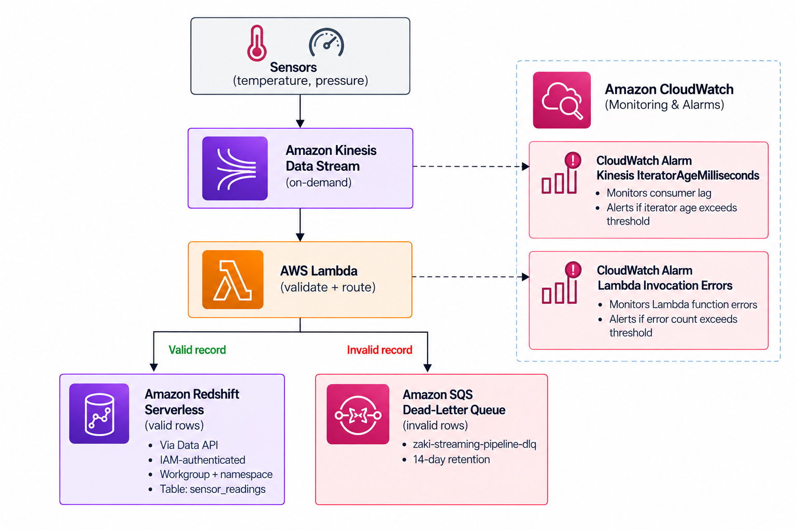
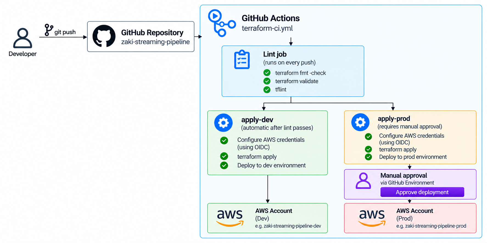

# Streaming Sensor Ingestion Pipeline — Terraform + CI/CD

A real-time AWS pipeline that ingests industrial sensor readings, validates
them in-flight, and routes each reading to the right place — clean data into
a queryable warehouse, bad data into a quarantine queue for review — with
every piece of infrastructure defined in Terraform and deployed through
GitHub Actions.

This is a fully standalone, independent project: cloning this repo alone is
enough to deploy the entire pipeline. It shares no AWS resources and no
Terraform state with any other project in this portfolio.AWS allows only one OIDC provider per URL per account, and this account's provider was created by another project in this portfolio.If you clone *only* this repo into a completely
fresh AWS account that has never had any GitHub Actions OIDC integration
set up, the bootstrap's `data "aws_iam_openid_connect_provider"` lookup
will fail, because there's nothing yet for it to find. The fix in that
case is a one-time, one-line addition of a `resource
"aws_iam_openid_connect_provider"` block (not included here, since this
account already has one)


## The problem

A milling and classification system — including a heater used to dry
materials in material handling produces a continuous stream of
temperature and pressure readings from its sensors. Unlike a daily batch
export, this data needs to be ingested as it's produced, validated
immediately, and made available for querying with low latency. Bad
readings (out-of-range values, missing fields, malformed payloads) need to
be quarantined and visible, not silently dropped or allowed to corrupt
downstream analysis.

Constraints:
- Latency: near real-time ingestion, not a daily/on-demand batch job
- Throughput: variable and not precisely predictable in advance (sensor
  bursts, idle periods)
- Consumers: need queryable, structured access to valid readings
- No AWS account IDs or personal details may appear in files committed to
  the (public) GitHub repo
- Fully standalone: no shared resources or Terraform state with any other
  project — cloning this one repo is enough to run the whole pipeline

## Architecture




Deployment path:




All AWS access from CI uses OIDC federation — no long-lived AWS access keys
are stored in GitHub at any point.

## Alternatives considered

**Kinesis capacity mode: on-demand vs. provisioned (shard-based).**
Chose on-demand, which scales automatically with incoming traffic and
requires no upfront capacity planning. Provisioned mode is cheaper at
steady, predictable, high-sustained throughput, but requires estimating
shard count in advance and manually resharding as traffic changes — not a
good fit for sensor traffic whose volume isn't known ahead of time.

**Redshift: Serverless vs. a provisioned cluster.**
Chose Redshift Serverless, which has no cluster to size and bills based on
usage rather than running continuously regardless of load. A provisioned
cluster gives more predictable cost at constant heavy usage, but runs (and
bills) 24/7 whether or not it's handling traffic a poor fit for a
portfolio project with intermittent, bursty ingestion.

**Writing to Redshift: fire-and-forget vs. polling for completion.**
Chose polling: the Redshift Data API's `execute_statement` call is
asynchronous — it confirms a statement was *submitted*, not that it
*succeeded*. Fire-and-forget is simpler and faster per record, but a real
failure downstream (bad value, permissions issue) disappears silently,
exactly as happened during testing (see below). Polling with
`describe_statement` costs a little latency per record but means a real
failure actually surfaces as a Lambda error instead of a false "success."

**Environment isolation: fully separate stacks vs. shared resources tagged
by environment.**
Chose fully separate resource stacks per environment (separate Kinesis
stream, Lambda, Redshift namespace/workgroup, state file — same pattern
used in the batch pipeline project), so a mistake in one environment can't
touch the other. The cost is running two Redshift Serverless workgroups
when both environments are active; mitigated by tearing down the Redshift
piece between working sessions when it isn't actively being tested.

**Bad records: dead-letter queue vs. silently dropping them.**
Chose an SQS dead-letter queue so quarantined readings stay inspectable —
you can see exactly what came in, why it was rejected, and when — instead
of losing that information the moment a reading fails validation.

**IAM permissions: broad role vs. per-resource least privilege.**
Same approach as the batch pipeline project: start from a reasonably
scoped baseline and add exactly the action a real `AccessDenied` error
says is missing, never a wildcard. This project hit several genuinely
narrow gaps this way (detailed below) rather than starting from an
admin-style policy.

**Manual approval gate: dev and prod, or prod only.**
Same reasoning as before — gate only prod behind manual approval, so dev
iterates freely while the environment other people might rely on still
has a human check before every change.


## What broke during testing (and how it was fixed)

- **Redshift Serverless workgroup creation failed on an unsupported
  availability zone.** `ValidationException: Subnet ... is in an
  unsupported availability zone.` The account's default VPC includes a
  subnet in `eu-west-2d`, which Redshift Serverless doesn't support in
  this region. Fixed by looking up each default subnet's availability
  zone with a `data "aws_subnet"` lookup and filtering out that AZ before
  passing the remaining subnet IDs to the workgroup.


- **Multiple rounds of least-privilege `AccessDenied` errors while
  standing up the `prod` environment through CI.** Each was fixed by
  adding exactly the missing action, never a wildcard:
  - `ec2:DescribeVpcAttribute` — a separate action from
    `ec2:DescribeVpcs`/`DescribeSubnets`/`DescribeSecurityGroups`, needed
    when Terraform reads an additional VPC attribute during the default
    subnet lookup.
  - `lambda:GetFunctionCodeSigningConfig` — needed for Terraform to read
    a Lambda function's full state during a plan.
  - `lambda:ListTags` on **event source mappings** — this action was
    already granted, but only scoped to *function* ARNs in one IAM
    statement. An event source mapping has a completely different ARN
    shape (UUID-based, not name-based), so the same action had to be
    granted again under a separate, wildcard-scoped statement.


- **Recurring GitHub Actions YAML indentation errors.** Hand-editing the
  workflow file to add the `apply-prod` job introduced inconsistent
  indentation more than once (a job shifted several spaces right of its
  siblings; a single step indented one space more than the others in its
  list) — each broke the entire workflow file with a line-specific YAML
  parse error. Fixed by comparing indentation character-for-character
  against a working sibling job/step rather than eyeballing it.

- **`terraform fmt` failures in CI.** `terraform fmt -check -recursive`
  flagged four files as inconsistently formatted. Fixed by running
  `terraform fmt -recursive terraform/` locally and committing the
  reformatted files — no logic changed, only whitespace/alignment.

## How to run it

### Prerequisites

- An AWS account
- [Terraform](https://developer.hashicorp.com/terraform) >= 1.10.0
- An AWS GitHub OIDC identity provider already present in the account
  (see "A note on 'fully standalone'" above)
- A GitHub repository with:
  - Repository **secrets**: `TFSTATE_BUCKET`, `AWS_ROLE_ARN`
  - A `production` GitHub Environment with a required reviewer, for the
    manual approval gate on prod deploys

### One-time bootstrap

The `terraform/bootstrap` module creates the shared, account-level
resources this project depends on: the S3 bucket used for Terraform
state, and the least-privilege IAM role GitHub Actions assumes to deploy.
This is applied once, locally, by whoever sets the project up — not by CI.

### Redshift setup (per environment)

Terraform provisions the Redshift Serverless namespace and workgroup, but
the table and IAM database grant are created manually via Query Editor
v2, once per environment:

```sql
CREATE TABLE sensor_readings (
    device_id VARCHAR(64),
    sensor_type VARCHAR(20),
    reading_value FLOAT8,
    unit VARCHAR(20),
    reading_timestamp TIMESTAMP
);

GRANT INSERT, SELECT ON sensor_readings
  TO "IAMR:<project-prefix>-lambda-execution";
```

Note the `IAMR:` prefix (for an IAM *role*, not `IAM:` for an IAM user) —
see "What broke during testing" above for why this matters. The
`<project-prefix>-lambda-execution` user is auto-created by Redshift the
first time the Lambda successfully authenticates; if the `GRANT` errors
with "user does not exist," run a `CREATE USER "IAMR:..." WITH PASSWORD
DISABLE;` first.

### Deploying dev and prod

1. Push a change to a branch and open a pull request — the `lint` and
   `plan-dev` jobs run automatically and show the planned changes.
2. Merge to `main` — `apply-dev` runs automatically.
3. `apply-prod` then waits for manual approval in the `production` GitHub
   Environment before applying the same changes to the prod environment.

Each environment (`terraform/envs/dev`, `terraform/envs/prod`) has its own
Terraform state file in the same state-storage S3 bucket, and its own
fully independent set of resources (Kinesis stream, Lambda, Redshift
namespace/workgroup, DLQ), so a dev deploy can never affect prod
resources.

### Running locally

```
cd terraform/envs/dev
terraform init -backend-config="backend.hcl"
terraform plan
```

`backend.hcl` and any `.tfvars` files are gitignored — each environment
needs its own local copies (see each module's `variables.tf`) since
they're never committed to the repo.

### Sending test data

With the infrastructure deployed, send sample sensor readings to Kinesis:

```
python src/produce_sensor_events.py --count 20 --interval 1
```

This sends a mix of realistic and deliberately invalid readings (roughly
a 5% invalid rate) so you can see both the Redshift write path and the
dead-letter queue routing in action.

### Cost note

Redshift Serverless is the one always-billing piece of this stack when
active. It's worth tearing down between working sessions if you're not
actively testing:

```
terraform destroy -target="module.redshift"
```

run from inside each environment's directory (`terraform/envs/dev` or
`terraform/envs/prod`). Kinesis, Lambda, SQS, and the CloudWatch alarms
are cheap-to-free when idle and can stay deployed.